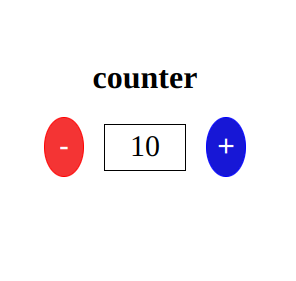

# count

This project is named count.

## APP

## ABOUT

This project greats a simple count for a number.
the count can either increase or decrease.

## Built With

- HTML
- CSS
- Google Chrome

## Clone project

- To get a local copy up and running follow these simple example steps.
- Clone this repository with
`https://github.com/kadjialan/counter-page-js` using your terminal.
- Change to the project directory by entering: cd counter in the terminal.

## Command-line steps

- $ git clone `$ https://github.com/kadjialan/counter-page-js`
- $ `cd counter`
- $ `git checkout feature/functionality`

## Start App

- run any browser(google chrome, safari)

## Prerequisites

Knowledge about:

- HTML
- CSS
- Google Chrome

## Live Site

[Link]( https://kadjialan.github.io/counter-page-js/)

## Author

👤 **Kadji Alan**

- GitHub: [@kadji alan](https://github.com/kadjialan/)

## 🤝 Contributing

Contributions, issues, and feature requests are welcome!

Feel free to check the [issues page](https://github.com/kadjialan/grid-page-js/issues).

## Show your support

Give a ⭐️ if you like this project!